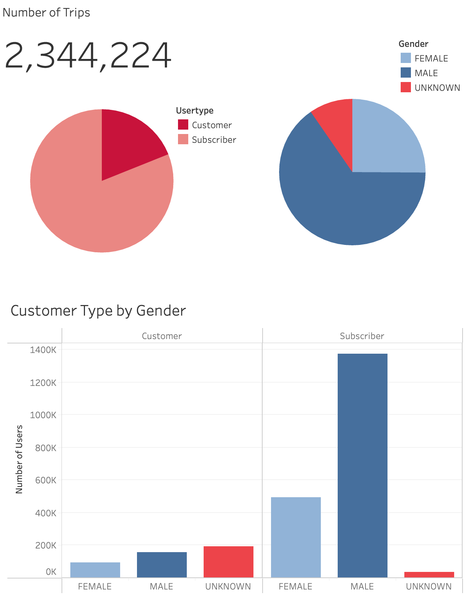
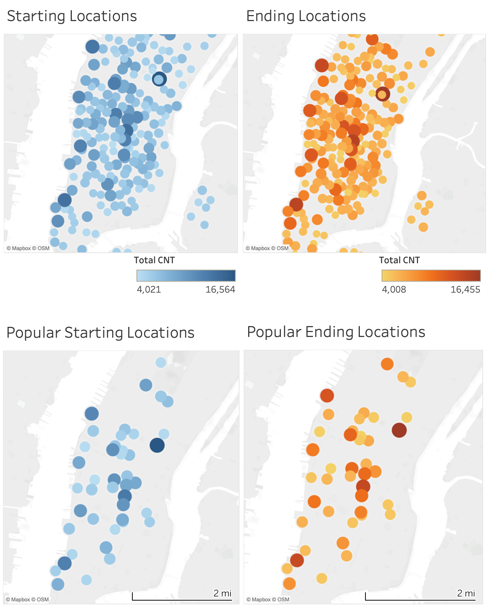
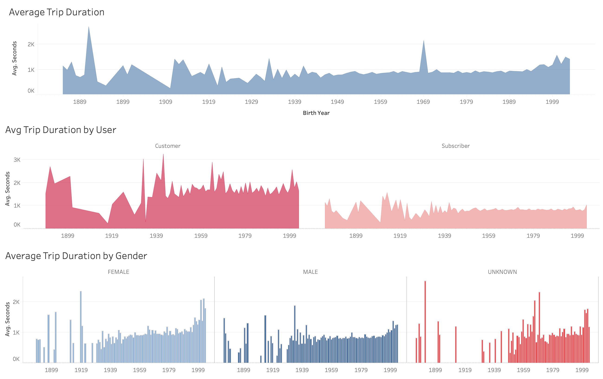
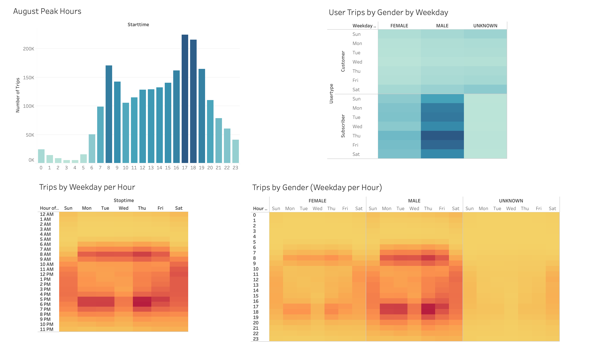
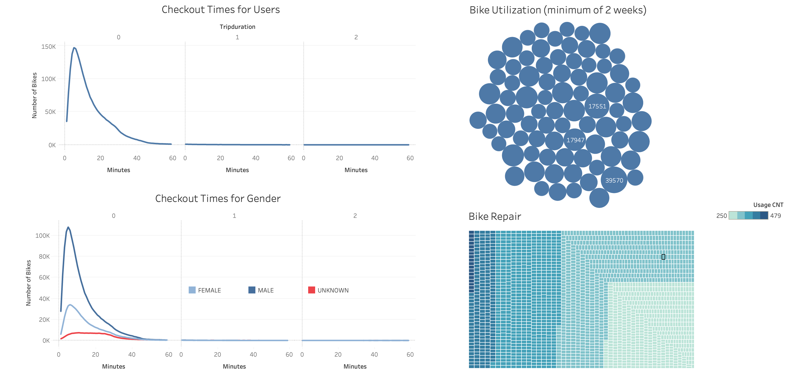

# Analysis Overview
The purpose of this bike sharing analysis is to gather insights and information that will help investors make informed decisions about the potential bike-sharing program in Des Moines. 

### About the Data
Our data is from the month of August. There tends to be more traffic during the summer months. User Type (Customer = 24-hour pass or 3-day pass user; Subscriber = Annual Member). Trip Duration (seconds).

Data was retrieved from [citibikenyc.com/system-data](https://citibikenyc.com/system-data).

## Results
[New York Citibike Sharing Program Dashboard](https://public.tableau.com/views/NewYorksCitibikeSharingProgramResultsAugust2019/BikesharingResults?:language=en-US&:sid=&:display_count=n&:origin=viz_share_link).

### Key Findings
- In August, there were a total of 2,344,224 bike trips, with the majority (81.07%) made by subscribers.
- Male users constituted the largest portion of ridership, accounting for 65.28% of all trips, followed by females (25.10%), and an unknown gender category (9.62%).
- Among subscribers, the gender distribution was skewed towards males (72.23%), with females accounting for 25.98%.
- The top three starting and ending locations were Pershing Square, 860 Broadway, and Tribeca Bridge, indicating these areas as popular hubs for bike riders.
- By contrast, 456 5th Ave, S Ferry Bus Lp, and Rivington St were the least used ending locations.
- Rubin Residence Hall, 515 5th Ave, and 401-499 W 56th St were among the least utilized starting locations.
- The average trip duration for customers was longest among those of unknown gender (2,466.67 seconds), followed by females (1,949.51 seconds), and males (1,574.51 seconds).
- Subscribers had shorter average trip durations, with females averaging 839.96 seconds, males 791.70 seconds, and those of unknown gender 837.99 seconds.
- The peak usage times were observed at 17:00, 18:00, and 8:00, while the least starting times occurred at 3:00 on Tuesdays, Mondays, and Wednesdays.
- Bike maintenance data revealed that the majority of bikes were used for less than 20 minutes, with some outliers used for longer durations and 18 bikes being heavily used more than 430 times.

### Over Bike Trip Trends

User Demographics:

Stats: 2,344,224 bike trips in august; 81.07% subscribers, 18.93% customers; 65.28% male, 25.10% female, 9.62% unknown; subscribers: 72.23% male, 25.98% female, 1.79% unknown; 43.15% unknown, 35.52% male, 21.33% female; 

Popular Locations:

Stats: The top three starting and ending locations: Pershing Square (16,564, 16,455 users), 860 Broadway(14,345, 14,904 users), Tribeca Bridge (13,875, 14,730 users). The least three ending locations: 456 5th Ave (4,008), S Ferry Bus Lp (4,010), Rivington St (4,050); The top three least starting locations: Rubin Residence Hall (4,021), 515 5th Ave (4,039), 401-499 W 56th St (4,043);

Trip Duration Distribution:

Measurement is in seconds.
Stats: 2040 customers, 819 subscribers; 2221 unknown, 1064 females, 872 males; Customers: 2,466.67 unknown, 1,949.51 female, 1,574.51 male; Subscribers: 839.96 female, 837.99 unknown, 791.70 male; 

Peak Usage Times:

Measurement is in militarty time.
Stats: 17, 18, 8 are the start times for most users, respectively. Top three least starting times: Tuesday at 3 (360), Monday at 3 (432), Wednesday at 3 (450). Top three most starting times: thursday at 18 (44,905), thursday at 18 (43,982), friday at 17 (37,467);  

Bike Maintenance:

Stats: Majority of bikes are used for less than 20 minutes. Those of unknown gender use bikes for longer then 20 minutes as compared to males and females. 13,983 bikes; 81 used for 2 weeks, 11 for 4 weeks, 1 for 6 weeks and longer. 18 bikes have been used more than 430 times.

## Summary
The analysis of bike trip data for August revealed key insights into user demographics, trip duration, popular bike locations, peak usage hours, and bike maintenance trends. Overall, the majority of trips were made by subscribers, with males representing the largest user demographic. Pershing Square, 860 Broadway, and Tribeca Bridge were the most popular bike stations, while peak usage occurred during evening hours. The average trip duration varied among different user groups, with customers generally taking longer trips compared to subscribers. 
